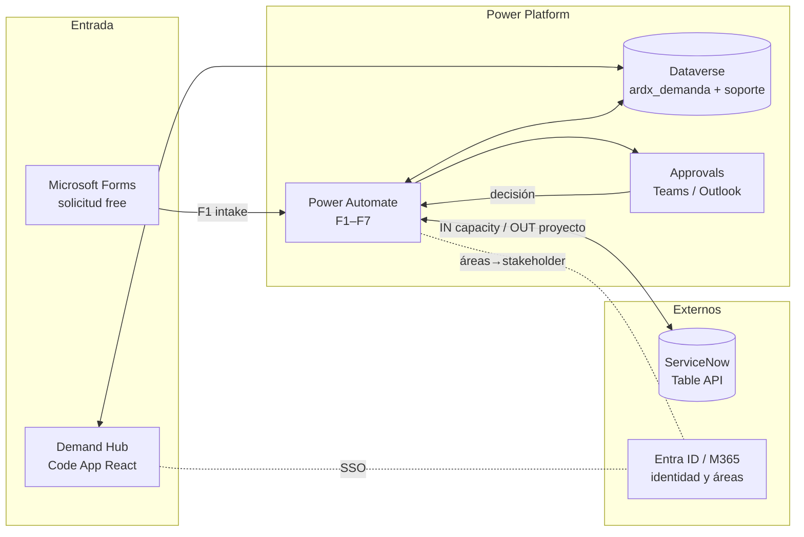
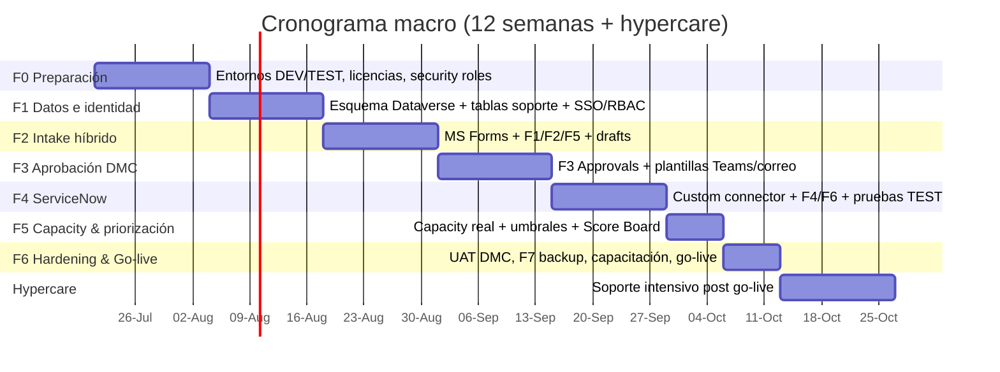

# Demand Hub — Plan de Implementación
### Power Apps Premium · High-code (Code Apps) · Dataverse · Power Automate

**Cliente:** Abbott — IT Hub (DMC) · **Proveedor:** LIT Digitall
**Fecha:** Julio 2026 · **Versión:** 1.0 · **Estado del prototipo:** validado (demo pública + análisis UX aplicado)

---

## 1. Resumen ejecutivo

El prototipo de **Demand Hub** (intake, scoring automático, aprobación DMC y priorización capacity vs. score) está validado por el negocio. Este documento define **cómo llevarlo a producción** sobre la plataforma Power Apps en su modalidad **high-code (Code Apps)**: la misma aplicación React ya construida se publica dentro de Power Apps con `pac code push`, conectada a **Dataverse** como base de datos, **Power Automate** para las automatizaciones, **Microsoft Entra ID / M365** para identidad y **ServiceNow** vía API para capacity y publicación de proyectos.

| Dimensión | Decisión |
|---|---|
| Front-end | Code App (React + Vite, ya construido) publicado vía Power Platform CLI |
| Datos | Dataverse — tabla `ardx_demanda` (existente) + tablas de soporte |
| Identidad / RBAC | Entra ID (M365); roles: Requester, Sponsor, Tech Lead, PMO, Director (DMC), Admin |
| Entrada "free" | Microsoft Forms → Power Automate → Dataverse (sin licencia premium para el solicitante) |
| Aprobaciones | Power Automate + conector **Approvals** (Teams + correo con enlace a la demanda) |
| Integración | ServiceNow Table API (capacity IN · proyecto aprobado OUT · estado SYNC) |
| Licencias | **Power Apps Premium** para usuarios del app (~10 personas DMC/operación); solicitantes entran por Forms sin costo |

**Duración estimada: 12 semanas** (6 fases) + 2 semanas de hypercare.

---

## 2. Arquitectura destino

**Entorno actual (ya aprovisionado):**
- App: **Demand Hub** — appId `785908fe-958b-43fa-87fc-0ba475bdba81`
- Environment: `aa9aa103-53ae-e549-8f11-8e79e2d2bfec` (region: prod) — se recomienda crear **DEV** y **TEST** equivalentes
- Tabla: `ardx_demanda` (entity set `ardx_demandas`)
- Deploy: `pac auth create` → `npm run build` → `pac code push` (ver `POWERAPPS-DEPLOY.md`)

---

## 3. Modelo de datos (Dataverse)

### 3.1 Columnas nuevas en `ardx_demanda`
El prototipo agregó campos que deben existir como columnas antes del go-live:

| Campo (app) | Columna sugerida | Tipo | Notas |
|---|---|---|---|
| category | `ardx_category` | Choice (Strategic/Operational) | Clasificación SPM |
| clasificacion | `ardx_clasificacion` | Choice (Infra/IA/Apps/Otro) | Vistas Sambini / IA / Gabriela |
| clasificacionOtro | `ardx_clasificacionotro` | Text | Cuando "Otro" |
| impactoAbrangencia | `ardx_impactoalcance` | Choice (1–4) | Dispara score automático (25 %) |
| roiEstimado | `ardx_roi` | Decimal | % |
| rce | `ardx_rce` | Text | **Capturado en intake (Paso 3)** |
| appId / appName | `ardx_appid`, `ardx_appname` | Text | Nombre auto vía registro de apps |
| abbottProjectType | `ardx_abbottprojecttype` | Choice | ME / Rapid / Phase 0 / Operations / Project |
| temSolucaoProposta | `ardx_tienesolucion` | Yes/No | Con detalle en solución propuesta |
| deadline vencida | *(calculada)* | — | Vista/rollup para "Overdue" |

### 3.2 Tablas de soporte (hoy en localStorage → migrar)
| Tabla | Contenido | Origen actual |
|---|---|---|
| `ardx_area` | Áreas solicitantes (incl. **Facilities**) + **stakeholder responsable** (lookup a usuario M365) | adminLookupService |
| `ardx_sponsor` / `ardx_avaliador` | Sponsors y evaluadores | adminLookupService |
| `ardx_appregistry` | APP ID → nombre de aplicación | `APP_REGISTRY` (código) |
| `ardx_capacity` | Capacidad por equipo (horas/mes, FTE) + snapshot diario de ServiceNow | `CAPACIDADE_PADRAO_HORAS` |
| Adjuntos | Columna **File** en Dataverse (límite 10 MB ya aplicado en UI) | mock |

---

## 4. Seguridad, roles y licenciamiento

- **SSO** con Entra ID: el usuario del app es la identidad M365; el **área solicitante se vincula automáticamente** al perfil del usuario (requisito de la reunión 18-jun).
- **Security roles** en Dataverse espejando los 6 roles del app. El gating por rol ya existe en el motor (`src/domain/workflow.ts`) — en producción el rol viene del security role, no de cuentas demo.
- **Licencias:**
  - Code Apps requiere **Power Apps Premium** por usuario del app → dimensionado para **10 personas DMC/operación** (punto abierto de costo a validar por Governanza — item 5/6 de la minuta).
  - **Solicitantes no pagan licencia**: entran por Microsoft Forms (F1) y consultan estado vía notificaciones por correo con enlace (el enlace abre el app solo para usuarios licenciados; para no licenciados el flujo F5 envía el estado por correo).
- **Backup** (requisito): activar retención/recycle bin de Dataverse + export semanal automatizado (F7) para recuperación ante borrado accidental.

---

## 5. Automatizaciones a construir (Power Automate)

| # | Flujo | Trigger | Acciones principales | Conectores |
|---|---|---|---|---|
| **F1** | Intake free (Forms) | Nueva respuesta en MS Forms | Crear fila en `ardx_demanda` (status *In triage*, score de impacto automático por alcance, stakeholder por área) → correo de confirmación al solicitante con nº DEM y enlace | Forms, Dataverse, Outlook |
| **F2** | Notificación de triage | Fila creada / modificada a *In triage* | Aviso Teams + correo al PMO con resumen del intake | Dataverse, Teams, Outlook |
| **F3** | **Aprobación DMC** (núcleo) | Status → *In approval* | **Approvals secuencial** Sponsor → Tech Lead → Director. Cada gate: tarjeta Teams + correo **formateado** (preguntas del intake + desglose del score + RCE informativo + **enlace a la demanda**). Escribe decisión/comentario en Dataverse; recusa → *Rejected*; 3 aprobados → *Prioritized* | Dataverse, Approvals, Teams, Outlook |
| **F4** | Publicar en ServiceNow | Status → *Prioritized* (todas las aprobaciones OK) | POST/PATCH `pm_project` (RCE, APP ID, score, estado) → guarda nº PRJ en la demanda; aviso al PMO | Dataverse, HTTP/Custom connector |
| **F5** | Estado al solicitante | Cambio de status | Correo al solicitante con el nuevo estado y enlace (transparencia sin licencia) | Dataverse, Outlook |
| **F6** | Capacity sync (IN) | Programado — diario 06:00 | GET ServiceNow `resource_allocation` → upsert `ardx_capacity` (FTE, horas comprometidas por equipo) | HTTP/Custom connector, Dataverse |
| **F7** | Watchdog & backup | Programado — diario / semanal | (a) Demandas con deadline vencida → alerta PMO/owner; (b) export semanal de respaldo a SharePoint | Dataverse, Teams, SharePoint |

> Los templates de contenido (correo formateado con preguntas + score) ya existen en el prototipo (`NotifyButton`) y se trasladan tal cual al cuerpo del Approval/correo.

---

## 6. Integración ServiceNow — definición

**Patrón:** custom connector (OAuth 2.0 client credentials, usuario de integración) sobre **Table API**; secretos en Azure Key Vault / variables de entorno; instancias DEV→TEST→PROD espejadas con los entornos Power Platform. La lógica del app ya está aislada en `src/integrations/serviceNow.ts` — en producción cada función se sustituye por la llamada real sin tocar el resto del código.

| Dirección | Dato | Endpoint (Table API) | Frecuencia |
|---|---|---|---|
| **IN** ↓ | FTE / horas comprometidas por equipo | `GET /api/now/table/resource_allocation` | Diaria (F6) + botón "Sync" on-demand |
| **OUT** ↑ | Proyecto aprobado: RCE, nº, APP ID, score, estado | `POST/PATCH /api/now/table/pm_project` | Evento (F4, al aprobar DMC) |
| **SYNC** ↔ | Estado del proyecto | `GET /api/now/table/pm_project/{sys_id}` | Diaria / on-demand |

**Mapeo de campos** (ya visible en el panel *ServiceNow Integration* del app):

| Demand Hub | Dir. | ServiceNow |
|---|---|---|
| capacity (horas/FTE) | IN | `resource_allocation.hours` |
| RCE | OUT | `pm_project.u_rce` |
| Nº proyecto | OUT | `pm_project.number` |
| APP ID | OUT | `pm_project.u_app_id` |
| Score ponderado | OUT | `pm_project.u_score` |
| Estado / status | OUT | `pm_project.state` |

**Pendiente con el equipo ServiceNow:** confirmar tablas/campos custom (`u_rce`, `u_app_id`, `u_score`), credenciales de integración por ambiente y throughput permitido.

---

## 7. Capacity — definición

- **Equipos:** Internal Delivery (**Wipro/Abbott**) · External Delivery (**terceros/contractors**) · Support.
- **Línea base** (parametrizable en `ardx_capacity`): 640 h/mes · 960 h/mes · 480 h/mes (FTE = horas ÷ 160). En producción la línea base se **sobrescribe con el dato real de ServiceNow** (F6).
- **Conteo de esfuerzo:** desde la **evaluación técnica** (Phase 0), definido por el equipo técnico (FTE resource) — el solicitante no estima.
- **Ruteo por esfuerzo/valor** (automático, ya implementado): `< 80 h → Minor Enhancement` · `< US$ 500k → RAPID/Sprint` · `> US$ 500k → Phase 0`. *(Umbral 500k según minuta; confirmar vs. slide "$500M".)*
- **Regla de priorización (PMO):** ranking por **capacity disponible vs. score**; score 5.00 (100 %) = máxima prioridad; semáforo de utilización 70 % / 90 % / 100 % (sobreasignación bloquea "Start execution").

---

## 8. Roadmap de implementación — cronograma macro

| Fase | Semanas | Entregables clave | Responsables |
|---|---|---|---|
| **F0 — Preparación** | 1–2 | Entornos DEV/TEST, 10 licencias Premium confirmadas, security roles, pipeline `pac` (CI) | Governanza + Equipo Técnico |
| **F1 — Datos e identidad** | 3–4 | Columnas nuevas en `ardx_demanda`, tablas de soporte, SSO Entra ID, RBAC por security role, migración de servicios mock → Dataverse | Equipo Técnico |
| **F2 — Intake híbrido** | 5–6 | Form MS Forms publicado, F1/F2/F5 en producción de prueba, confirmación al solicitante, save-draft | Equipo Técnico + PMO |
| **F3 — Aprobación DMC** | 7–8 | F3 (Approvals secuencial) con plantillas formateadas y write-back; Approvers Status con datos reales | Equipo Técnico + DMC |
| **F4 — ServiceNow** | 9–10 | Custom connector, F4 (OUT) y F6 (IN) contra instancia TEST, mapeo validado con equipo SN | Equipo Técnico + ServiceNow team |
| **F5 — Capacity & priorización** | 11 | Capacity con FTE real, umbrales, regla capacity vs. score operativa | PMO |
| **F6 — Hardening & go-live** | 12 | UAT con DMC (10 personas), F7 backup/watchdog, capacitación, **go-live** | Todos |
| **Hypercare** | 13–14 | Soporte intensivo, ajustes finos, handover | Equipo Técnico |

**Hitos de validación:** fin de F2 → demo intake a Sambini/Gabriela · fin de F3 → aprobación piloto real con DMC · fin de F4 → primer proyecto publicado en ServiceNow TEST.

---

## 9. Supuestos y riesgos

| # | Riesgo / supuesto | Impacto | Mitigación |
|---|---|---|---|
| 1 | Aprobación del costo de 10 licencias Premium (Global) | Bloquea F0 | Decisión de Governanza en semana 1; alternativa: reducir personas licenciadas |
| 2 | Acceso a instancia ServiceNow TEST + campos custom | Desplaza F4 | Solicitar credenciales/campos en F0 (lead time largo) |
| 3 | Umbral **US$ 500k vs US$ 500M** sin confirmar | Regla de ruteo | Confirmar con Sambini en la próxima reunión (parámetro central, cambio de 1 línea) |
| 4 | Dueño del portafolio **Inteligencia Artificial** sin definir | Vistas/filtros | Definir en F1 |
| 5 | Adjuntos > 10 MB o volumen alto | Almacenamiento | Columna File Dataverse (límite 10 MB) o SharePoint si crece |
| 6 | Borrado accidental de datos | Pérdida de información | F7 backup semanal + recycle bin (retención 30 días) |

---

## 10. Próximos pasos inmediatos (semana 1)

1. **Governanza:** confirmar licenciamiento Premium (10 personas DMC) y política de acceso.
2. **Equipo Técnico:** crear entornos DEV/TEST; ejecutar `pac auth create` + `pac code push` del build actual como línea base.
3. **PMO:** validar con Sambini el umbral 500k, el dueño del portafolio IA y los criterios finales de impacto.
4. **ServiceNow team:** solicitar credenciales de integración y validar el mapeo de la sección 6.
5. Kick-off de F0 con este documento como alcance.

---

*Documento generado a partir del prototipo funcional (https://litdigitall.github.io/demand-hub/), la minuta del 18-jun-2026 y el análisis UX "Analisis Demand APP Intake".*
